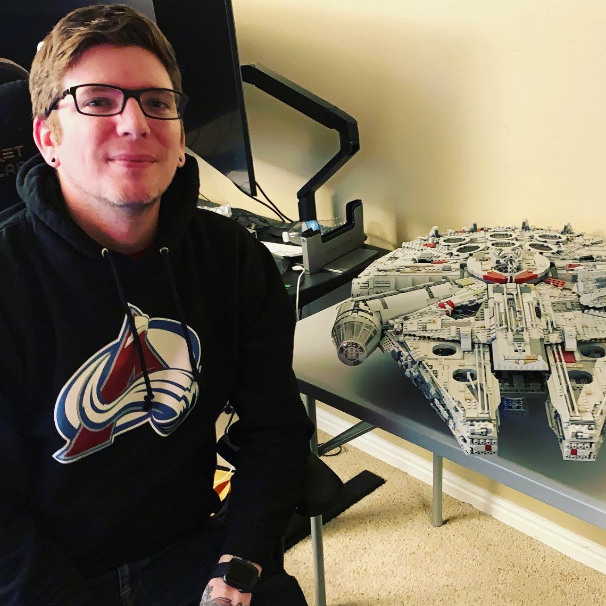

My name is Josh and I'm a software engineer from Denver, CO who loves to create,
learn, and make life better for others and myself with technology.

## Some things I love:

- Development and learning new technologies and/or languages
- Guitar and music production
- Video games
- Keyboards and mice
- Running
- Traveling
- Craft Beer
- Collecting and building Star Wars Lego sets

## Technology

### Languages

- Go
- JavaScript (TypeScript)
- Rust

### Platforms

- Docker
- NodeJS

### Gaming Platforms

- PC
- PS4
- Nintendo Switch
